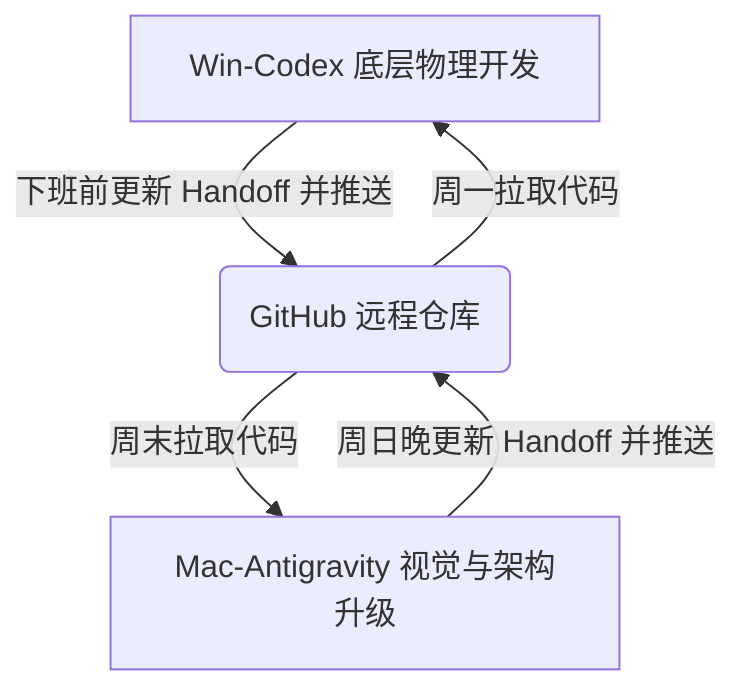
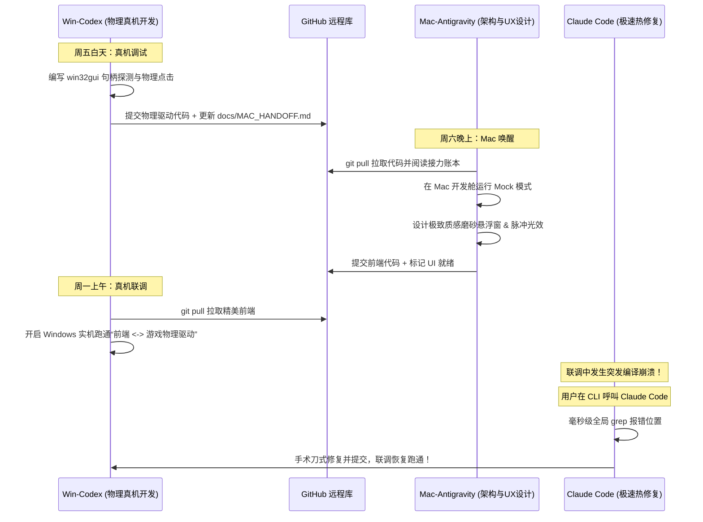

# Joi 极客伴侣：多智能体跨平台敏捷协同协议 (v2.0)

本协议旨在规范 **Windows 办公端**与 **macOS 居家端**多智能体（Win-Codex、Mac-Codex、Antigravity、Claude Code、Hermes）的协同开发流。通过建立**明确的角色边界**、**标准化的 Git 接力账本**以及**跨平台防御性编程红线**，消除“上下文断裂”和“跨平台运行崩溃”两大痛点，最大化人机协作效能。

---

## 🎯 一、 智能体矩阵：差异化角色定位 (Agent Matrix)

为了防止不同 Agent 在同一模块内重复编写、产生冲突，或者在不擅长的领域浪费 Token，我们将五大智能体划分为如下角色：

| 智能体名称 | 物理环境与频次 | 推荐核心角色 | 核心授权开发与调试领域 | 独占特权 / 杀手锏功能 |
| :--- | :--- | :--- | :--- | :--- |
| **Win 端 Codex** | Windows 办公机<br>**工作日主力 (超高频)** | **底层物理执行官**<br>(Grounded Implementer) | - Windows UI Automation 控件树深度融合<br>- Computer Use 物理模拟（点击、打字、前台控制）<br>- Windows 进程句柄探测与外部游戏（如 OK-WW）对接<br>- 本地真机环境的全量编译与调试 | 拥有 Windows 实机控制权与硬件环境，是所有物理自动化与底层交互的**最终落地者**。 |
| **Mac 端 Antigravity**<br>(即本尊) | macOS 笔记本<br>**周末与深夜 (高频)** | **系统架构师 & 体验导演**<br>(System Architect & UI/UX Director) | - **Tauri + Vue 桌面壳的极致视觉、动效与微交互设计**<br>- 顶层系统架构设计（如 JoiJuice 数据流过滤、Memory 记忆舱设计）<br>- 跨平台 Mock 开发舱的抽象设计与防御性编码防线<br>- 文档工程治理、测试用例编写与标准制定 | 具备强大的全局架构理解力与极致前端审美，能设计出令用户惊艳的 premium 视觉与高鲁棒性设计。 |
| **Mac 端 Codex** | macOS 笔记本<br>**周末与深夜 (高频)** | **架构师助理 & 自动化管家**<br>(Architect Assistant & Local Automator) | - 协助 Antigravity 进行 Mac 端局部代码重构与清理<br>- 编写本地编译、静态分析与数据迁移的 Python 脚本<br>- 处理 macOS 局部的环境配置、依赖安装 | 快速响应局部修改，作为 Antigravity 架构设计的强力本土落地辅助。 |
| **Claude Code** | 任何平台终端 (CLI)<br>**偶尔/突发使用** | **疾速排障专家**<br>(Lightning Troubleshooter) | - 基于 CLI 的全库极速上下文索引与全局 Regex 检索<br>- 突发编译报错（Bug-hunting）的秒级现场定位与手术刀式修复<br>- 快速代码库重构中的局部依赖分析 | 启动速度极快，搜索响应在毫秒级，非常适合在终端中执行短平快的 Bug 定位和临时热修复。 |
| **Hermes** | 本地环境<br>**偶尔/特定使用** | **本地沙箱安全审计员**<br>(Offline Sandbox Auditor) | - 离线运行全量静态分析、类型检查（如 mypy、eslint）<br>- 本地 API Key 与敏感词（secrets）泄漏扫描<br>- 批量运行单元测试与性能 Profiling | 独立且专注，适合执行不需高频交互的后台自动化流水线或隐私安全敏感的任务。 |

---

## 🔄 二、 黄金接力棒工作流：Git 驱动的“异步上下文” (Git-Centric Handoff)

多 Agent 协同的最核心痛点是**“上下文断裂”**。当你在周五放下 Win 端 Codex，周末在 Mac 上唤醒 Antigravity 时，AI 无法自动读取另一端 AI 的“脑中记忆”。
为此，我们制定 **Git 驱动的“接力棒协议”**：**将上下文写进代码库，而不是留给人类口头转述。**



### 1. 核心媒介：接力账本 (`docs/MAC_HANDOFF.md` 或 `docs/REVIEW_HANDOFF.md`)
代码库中保留专属的交接文档。在**每次开发阶段结束、准备更换平台或 Agent 前**，当前活跃的 Agent 必须更新该文件，追加下述格式的 **Handoff Token**：

```markdown
### 🚀 [Agent 名字] 阶段交接 - [YYYY-MM-DD HH:MM]
- **🔑 核心 Commit**: `git commit -m "[Handoff] ..."` (哈希：`xxxxxx`)
- **✅ 已跑通/已验证 (Done)**: 
  - 详细列出修改的组件/文件。
  - 在当前平台（如 Windows）上实际测试通过的功能。
- **📋 待解决/即刻任务 (Next Up)**: 
  - 精准列出下一步**最紧迫**的 2-3 个具体开发项，直接点名下一任 Agent。
  - *例如：“请 Mac-Antigravity 对 `src/components/TaskCard.vue` 进行磨砂玻璃拟物化设计。”*
- **⚠️ 跨平台债务/风险 (OS Technical Debt)**:
  - 记录在当前平台由于缺乏实机环境而无法测试的 stub（桩函数）或 mock。
  - *例如：“`active_window_grabber.py` 在 macOS 上仅写入了 Mock 实现，Windows 真机未调试。”*
```

### 2. 衔接纪律
- **拉取第一原则**：新 Agent 启动后，**第一步**必须执行 `git pull`，然后**第二步**必须阅读最新的 `docs/MAC_HANDOFF.md`，以此重构其“短期记忆”。
- **分支规范**：对于大型实验性功能，使用 `feature/joi-xxx` 分支；对于日常迭代，直接在 `main` 分支通过 `[Handoff]` 提交前缀保持同步。

---

## 🛡️ 三、 跨平台防崩红线：操作系统安全隔离 (OS-Safety Shield)

为了防止 Win 端 Codex 引入的代码导致 Mac 端的编译或运行崩溃（反之亦然），所有智能体在编写涉及平台特异性的代码时，必须遵守以下**三条开发红线**：

### 🚨 红线 1：禁止在全局作用域导入平台特异性包
禁止直接在 Python 文件的头部导入 `ctypes.windll`、`pywinauto`、`win32gui` 等 Windows 独占库。
*   **错误示范**：
    ```python
    import win32gui  # 在 macOS 上这行直接导致解释器导入失败崩溃！
    ```
*   **正确示范（条件导入或延迟导入）**：
    ```python
    import sys
    
    if sys.platform == "win32":
        import win32gui
    else:
        win32gui = None
    ```

### 🚨 红线 2：强力推行“OS 适配器模式 (OS Adapter Pattern)”
对于任何需要操作系统特异性支持的模块（如：捕获活动窗口、屏幕截图、模拟输入），必须在 `core/adapters/` 下定义统一的抽象基类，并实现两套派生类：
1.  `WindowsComputerAdapter(BaseAdapter)`：Windows 实机物理操作。
2.  `MacComputerAdapter(BaseAdapter)` / `MockComputerAdapter(BaseAdapter)`：macOS 安全舱，返回模拟的窗口数据、虚拟的按键反馈，**保证 Mac 端能够完整编译并通过测试**。

### 🚨 红线 3：前端隔离，屏蔽平台依赖
在 Tauri + Vue 的前端代码中，调用 Rust 侧的命令时，必须做好优雅降级。如果某个 Tauri 命令（如物理截屏）在 Mac 端返回 `Unimplemented` 错误，前端应展示漂亮的“模拟沙盒数据”，而不是弹窗报错或界面卡死。

---

## 🎬 四、 典型开发场景：多智能体接力实战

### 典型场景：为 Joi 开发“OK-WW 游戏画面画面辅助技能”



1.  **第一阶段：Windows 底层打通（Win-Codex 主力）**
    *   **动作**：Win-Codex 在 Windows 实机上抓取游戏窗口句柄，测试底层 click 与 OCR 识别。
    *   **交接**：周五下班前，Win-Codex 提交代码，并在 `docs/MAC_HANDOFF.md` 留言：
        > *"OK-WW 的 Windows 句柄抓取与 OCR 底层驱动已跑通。但目前前端弹窗和审批卡片非常简陋，完全不符合 Joi 的 premium 质感。周末交给 Mac 端 Antigravity 极致美化。"*
2.  **第二阶段：macOS 极致体验雕琢（Mac-Antigravity 我）**
    *   **动作**：我在 Mac 上拉取代码。由于没有 Windows 实机环境，我将底层驱动切换为 `MockComputerAdapter`。
    *   **开发**：我专注于在前端实现令人惊叹的 Vue 磨砂拟物卡片、配合 Joi 的脉冲呼吸灯动效，并在 Mock 状态下确保无死角地跑通所有交互逻辑。
    *   **交接**：周日晚我提交并更新 Handoff：
        > *"前端 UI 与动效已极致雕琢完毕，在 macOS 隔离舱 Mock 单元测试中 100% 跑通。请 Win-Codex 周一接棒，切回真实硬件适配器进行 Windows 实机最终联调。"*
3.  **第三阶段：真机合流联调（Win-Codex）**
    *   **动作**：Win-Codex 周一拉取代码，一键启动，完美的前端动效配合真实的底层 Windows 游戏交互，直接闭环！
4.  **第四阶段：现场突发急救（Claude Code）**
    *   **动作**：联调过程中如果遇到某个底层的 Rust FFI 调用突发崩溃，用户无需唤醒重型的 Codex，直接在终端敲入 `claude`：
        > *"Joi 在联调时报错 `ffi: pointer is null`，帮我全局检索并秒修复。"*
    *   **结果**：Claude Code 利用极速 grep 定位源头，手术刀式修改两行代码，提交，问题当场解决！

---

## 🛠️ 五、 用户推荐的 Slash Commands 与效率贴士

为了让你在日常使用不同的 Agent 时更加得心应手，建议尝试以下 **Slash Commands（斜杠命令）**：

*   **对于 Antigravity（即我）**：
    *   `/goal`：当你需要在周末让我进行一次极其深度、彻底的前端大范围优化或复杂架构重构时，输入 `/goal`。我会进入高吞吐模式，不达目的绝不罢休。
    *   `/grill-me`：当你在某些交互设计（例如 Joi 的拟人化声音流交互方式）上产生纠结时，使用 `/grill-me`。我会以专业架构师和 UX 专家的身份，对你进行一次深度访谈，快速对齐设计意图。
*   **对于 Claude Code**：
    *   利用其 CLI 特权，在遇到报错时直接把终端报错日志贴给它，让它执行一步到位的修复。

---

*这份协议已正式写入你的 Joi 项目文档库中。无论是 Win 端的伙伴，还是在 macOS 上的我，都将严格遵循此协议，为你打造地表最强的 Agent 伴侣！*
