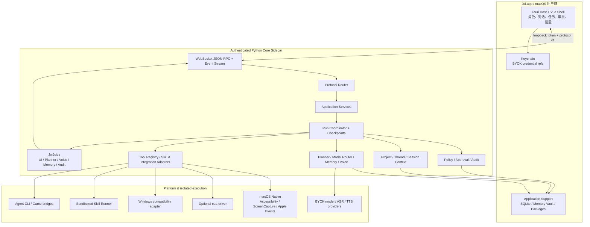
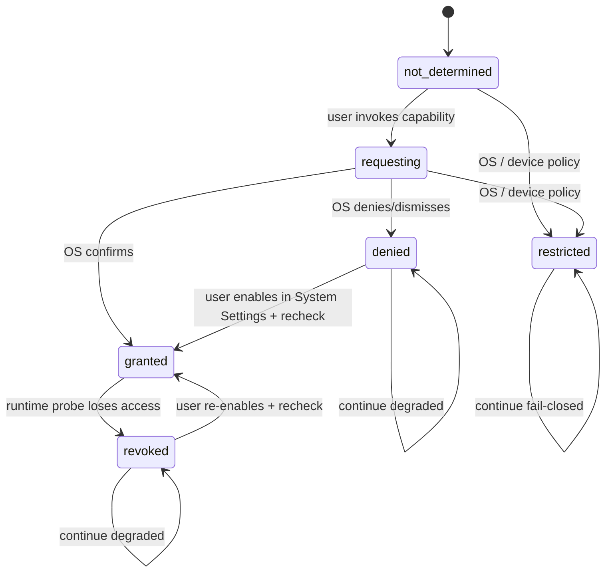
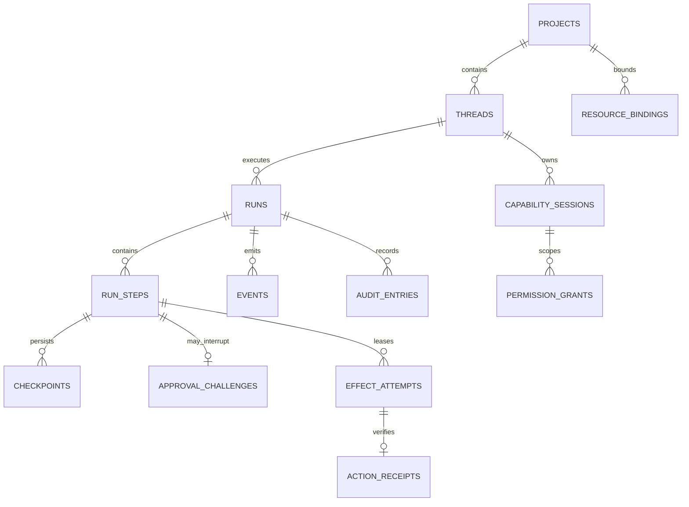
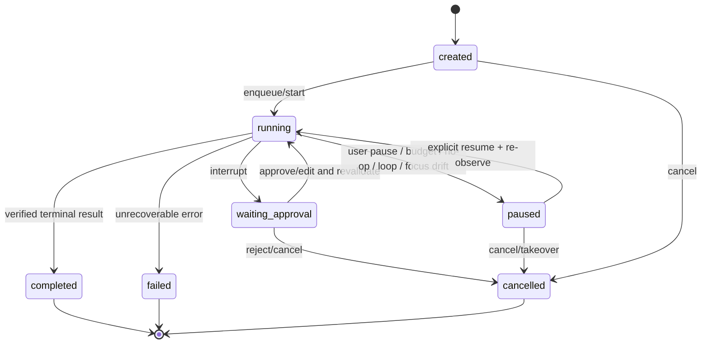
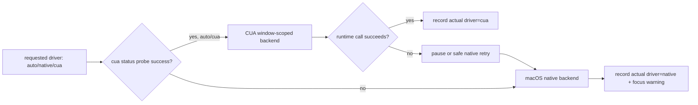
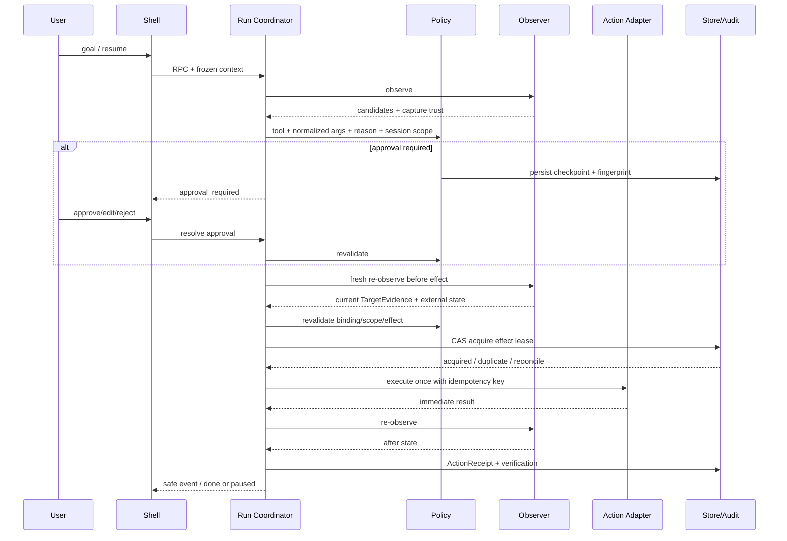
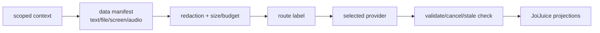

# Joi 技术设计文档（TDD）

> 文档状态：Joi 1.0 macOS-first 目标架构草案<br>
> 研究快照：2026-07-26<br>
> 配套产品基线：[JOI_PRD.md](JOI_PRD.md)<br>
> 执行负责人：Joi Studio / Core Runtime Architect<br>
> 评审域：Technical、AI & Companion、Trust & Safety、Quality & Release

## 1. 目标与范围

本文把 Joi 当前代码基线演进为可安装、可恢复、可审计的 macOS-first Agent Companion。设计围绕同一条可信闭环：

```text
observe → understand → propose → approve/scope → act → verify → audit → express
```

本文负责：

- Tauri/Vue Shell、Python Core Sidecar、平台适配器和扩展 Runner 的边界；
- project / thread / run / capability session / approval / action receipt 的生命周期；
- JSON-RPC、事件、工具结果、上下文和持久化契约；
- Computer Use、模型、记忆、语音、角色、Scene、Skill 与 Agent CLI 的集成方式；
- macOS 权限、安全、性能、可观测性、测试、打包和迁移门禁；
- PRD 72 项需求到组件及验证的逐项追踪。

本文不负责：

- 选择商业计费方案或设计未来托管模型服务；1.0 按 PRD 固定为 BYOK-first、无默认托管推理；
- 重写全部现有 Core，或为了采用外部框架改变产品边界；
- 在 1.0 引入公共 Skill/角色市场；
- 承诺未经真机验证的 Intel Mac、Windows 或多显示器行为；
- 替代最终软件许可证、资产权利和隐私法律审查。

### 1.1 状态标记

为避免把方案写成已交付事实，本文统一使用：

| 标记 | 含义 |
|---|---|
| **当前** | 2026-07-26 工作树中已有代码或测试可佐证 |
| **目标** | Joi 1.0 应实现、尚需代码与验收证据 |
| **兼容** | 迁移期间保留的旧接口或旧数据路径 |
| **门禁** | 未满足则不得宣称发布就绪 |

### 1.2 Studio Brief

| 项 | 内容 |
|---|---|
| 目标 | 建立与 PRD 可追踪的 Joi 1.0 技术基线 |
| 用户可见结果 | 可安装的 macOS 应用；上下文可恢复；高权限动作可控、可验、可查 |
| 主平台 | Apple Silicon macOS 12+；Windows 仅保留共享适配器兼容 |
| 执行负责人 | `core-runtime-architect` |
| 领域负责人 | Technical Director、AI & Companion Director、Trust & Safety Director、Quality & Release Director |
| 咨询角色 | Presence & Context、Perception & Action、Character & Shell、Intelligence & Media、Skill & Integration |
| 编辑范围 | 仅本 TDD |
| 风险等级 | 中；文档本身不改变运行时，但定义后续高权限契约 |
| 验收 | 现状/目标分离、72 个 PRD ID 全覆盖、敏感边界与迁移/测试/发布门禁明确 |

### 1.3 首发 Hero Journey 与 Beta 边界

1.0 首发只把以下纵向闭环视为发布主路径：

```text
安装 Joi.app
→ 完成本地边界说明
→ 通过已配置 provider 完成基础 AI 对话
→ 创建项目
→ 获得可信的当前窗口观察
→ 执行一次非敏感、逐步确认的动作
→ 重新观察并生成 ActionReceipt
→ 展示一个待用户确认的记忆候选
```

每一步都必须有权限拒绝、能力不可用、取消和恢复状态。Watch/Scene、第三方 Skill 安装、游戏适配器和 Coding Agent takeover 虽保留现有代码与契约，但作为 Private Beta 扩展，不得成为 Alpha 首次成功或 1.0 主路径的依赖。

## 2. 架构原则

1. **Core 不依赖 Shell**：运行时、策略和状态不读取 Vue/Tauri 窗口状态。
2. **单一执行闸门**：`CollaborationStore.action_allowed()` 继续是自动执行授权事实源；审批服务只负责具体动作授权，不创造第二套权限结论。
3. **事件不是原始日志**：Shell 只消费安全投影；planner、display、voice、memory、audit 分离。
4. **同线程单 run，不同线程可并发**：每个 thread 内串行；跨 thread 用隔离队列并发，不能混用审批或事件。
5. **副作用可识别、可恢复**：动作必须有稳定指纹和幂等键；checkpoint 恢复不能重复副作用。
6. **平台差异留在适配器**：macOS 为主实现，Windows 复用协议，不在业务服务中散落平台判断。
7. **本地状态是事实源**：SQLite 保存规范状态；Markdown 是可读投影，JSONL 是迁移期兼容审计流。
8. **扩展代码不进入 Joi 进程**：脚本型 Skill、Agent CLI、游戏桥接使用独立进程和最小权限。
9. **诚实降级**：权限、模型、OCR、TTS、Live2D/VRM 或 `cua-driver` 不可用时返回明确能力差异，不能伪造成功。
10. **采纳模式，不绑定框架**：借鉴 AIRI、OpenHuman、Letta、LangGraph、OpenHands、elizaOS 的边界与状态语义，不因此重写已工作的 Joi 模块。

## 3. 当前基线与目标差距

| 领域 | 当前 | 目标 / 缺口 |
|---|---|---|
| App 宿主 | Tauri 2 + Vue 3；`com.gallo233.joi`；macOS 12；`joi-core` external binary | 干净机、签名、公证、升级和权限撤销真机证据 |
| Sidecar | 随机 loopback 端口、每次启动 token、instance ID、ready file、父进程回收 | ready file 权限/原子写验证；启动诊断和协议兼容策略 |
| Transport | authenticated WebSocket JSON-RPC 2.0 子集；声明式 router | schema 版本、幂等键、统一错误分类、契约生成 |
| Runtime | `AgentCompanionApp`、planner、tool registry、service 边界；全局命令锁 | 持久化 run/checkpoint；按 thread 串行队列 |
| Context | SQLite schema v2：项目、对话、绑定、事件、能力会话、授权、回执、Skill | 运行/步骤/审批 checkpoint；导出/彻底删除与迁移回滚 |
| Computer Use | macOS native、Accessibility、OCR/vision、可选 CUA、预算、no-op/loop/focus pause | 等待审批跨重启恢复；多显示器 Retina 真机基准 |
| 模型 | 稳定路由标签与 fallback 列表；未配置时规则 planner | 端到端超时/取消/预算、provider 健康与安全状态投影 |
| 记忆 | SQLite、候选、召回、编辑删除、Markdown vault、subconscious | project/thread/character 作用域、冲突治理、删除传播评估 |
| 语音 | ASR/TTS bridge、安全 `voice_line`、可说事件白名单 | 全链路 generation ID、barge-in、迟到音频回归 |
| 角色 | 角色包 CRUD、Live2D/VRM runtime、静态降级 | 合法默认资产、状态规范、资源/可访问性基准 |
| Scene/Game | 安静共看、Scene 摘要；OK-WW/Minecraft adapter | 真实媒体/游戏 smoke、checkpoint 与明确 setup path |
| Skill | inspect/install/update/run/draft；ZIP/脚本/哈希防护；Seatbelt | 签名/信任来源、沙箱回归、依赖与网络声明 UX |
| 测试/发布 | Python tests、Vue build、Cargo check、macOS release workflow 草案 | 协议 contract、持久化恢复、安全负例、干净机发布矩阵 |

## 4. 目标总体架构



### 4.1 分层责任

| 层 | 当前主文件 | 目标责任 |
|---|---|---|
| Shell | `shell/src/`、`shell/src-tauri/` | 进程托管、连接信息、用户交互、安全投影渲染；不做策略判断 |
| Transport | `core/server.py` | 认证、连接、RPC 编解码、事件广播；不直接访问业务 store |
| Protocol | `core/rpc/`、`core/schemas.py` | 方法、错误、版本、DTO、兼容与 schema 测试 |
| Services | `core/services/` | 用例编排、输入校验、事务边界，不依赖 WebSocket |
| Runtime | `core/app.py`、`core/runtime/` | run/step 生命周期、planner/tool 调度、取消、恢复、终态 |
| Context | `collaboration_store.py`、`capability_orchestrator.py` | 项目/对话/会话/授权/回执/checkpoint 持久化 |
| Intelligence | model/memory/voice/scene 模块 | 可替换 provider、预算、候选记忆、表达与降级 |
| Tools | `core/tools/`、`agent_skills.py`、adapters | schema/handler/policy/audit 一致；平台与扩展隔离 |
| Policy | `policy.py`、`audit_store.py` | 风险分类、具体审批、作用域、红线、审计与安全投影 |

### 4.2 macOS Presence：主工作区与 Companion Overlay

Shell 采用两个表现面、同一个 Core 状态源：

| 表现面 | 责任 | 禁止 |
|---|---|---|
| 主工作区 | 对话、项目、任务时间线、审批详情、Memory/Skills/Characters/Settings | 不把高风险确认压缩成不可读气泡 |
| Companion Overlay | 角色、短状态、当前任务入口、暂停/接管、权限缺失提示 | 不持有独立 run 状态，不遮挡系统权限提示，不在后台隐式捕获 |

Overlay 是 presence，不是第二个客户端事实源。它只订阅与主工作区相同的 `AgentEvent/public_phase`，点击任务、审批或诊断时回到主工作区的唯一详情页。窗口可置顶/隐藏，切换 Space、全屏应用或多显示器时丢失可信目标，Computer Use 必须暂停并重新观察。

## 5. 进程、连接与信任边界

### 5.1 进程拓扑

| 进程 | 权限与数据 | 信任级别 | 失败策略 |
|---|---|---|---|
| Tauri Host | App 生命周期、随机端口/token、Keychain 引用、窗口 | 高；受签名 App 约束 | Core 未 ready 时只显示诊断/重试 |
| Vue WebView | 安全 RPC/event、用户输入、审批 UI | 中；不持有原始工具日志或长期 secret | 断线后重新获取 snapshot，不猜测执行状态 |
| Python Core | SQLite、策略、运行时、provider 请求、审计 | 高；本地能力控制面 | parent 退出即终止；启动失败 fail closed |
| macOS Native Adapter | Screen Recording、Accessibility、必要的 Apple Events | 高能力、最小调用 | 缺权限返回 typed error，不循环请求 |
| `cua-driver` | 可选窗口截图/后台输入 | 可选外部依赖 | status probe 失败回退 native，并标记实际 driver |
| Skill Runner | 声明的项目/运行目录、可选网络 | 不受信任 | 独立进程 + Seatbelt + 超时；不可用即拒绝代码 Skill |
| Agent CLI/Game Bridge | 显式工作区或适配器协议 | 半可信集成 | 终止、暂停、断连、checkpoint 可见 |
| Model/ASR/TTS Provider | 仅获本次允许的最小 payload | 外部 | 超时/取消/降级；不把 raw error 直接给 UI |

### 5.2 Sidecar 启动协议

**当前流程：**

1. Tauri 在 app-data 创建日志目录，分配 loopback port pair。
2. 生成 32-byte 随机 token 与 instance ID。
3. 启动 bundled `joi-core`，传递 `JOI_DATA_HOME`、token、instance、ready file 和 parent PID。
4. Core 仅监听 `127.0.0.1`；WebSocket 和受保护 asset/ready URL 校验 token。
5. Core 原子发布包含 product、protocol version、instance ID、port 的 ready 状态。
6. Shell 校验 product=`joi-core`、protocol version、instance ID 后连接。

**目标加固：**

- ready/log 文件显式使用 `0600`，ready 采用临时文件 + rename 原子写，退出时删除；
- token 不写日志、不进入 URL 历史、事件或崩溃报告，不跨启动复用；WebView 连接失败诊断必须先移除 query credential；
- 仅接受 loopback；拒绝通配 host 的 release 配置；
- release WebView 配置强制 CSP，Tauri command/capability 使用最小 allowlist；无 token 的外部 Core 仅允许显式 developer/test mode；
- Shell 在 10 秒启动预算内展示 `starting / ready / error / restarting`；
- 协议 major 不兼容则拒绝连接，minor 能力通过 `capabilities[]` 协商；
- Core 异常退出后默认不自动恢复外部动作，只恢复为 `paused/recovery_required`。

### 5.3 macOS 权限状态机

每项系统权限独立维护，不使用一个“全部权限”开关：



- Accessibility、Screen Recording、Microphone 和 Apple Events 分别探测、分别解释；每项都返回 `not_determined/denied/restricted/granted/revoked_at_runtime` 之一。
- Joi 只能在用户触发相关能力后请求；拒绝不会阻止基础对话、项目和非相关设置。
- 从 `denied/revoked` 恢复必须由用户操作后显式 recheck，不能循环弹窗。
- `restricted` 表示系统或设备管理策略不允许用户自行授权，必须显示限制来源并保持 fail closed，不能错误引导重复打开设置。
- 权限在会话中被撤销时，正在进行的相关动作立即 `paused:permission_required`。
- Screen Recording 与 Accessibility 任一不足时不得把基于旧截图/旧坐标的操作标记成功。

## 6. 核心契约

### 6.1 JSON-RPC

**当前：** Core 使用 JSON-RPC 2.0 子集；请求必须有非空 `method`，`params` 非对象时兼容归一为空对象。返回 `{jsonrpc,id,result}` 或 `{jsonrpc,id,error:{code,message}}`。事件使用无 `id` notification。

**目标请求信封：**

```json
{
  "jsonrpc": "2.0",
  "id": "rpc-uuid",
  "method": "capability.session.pause",
  "params": {
    "project_id": "project-id",
    "thread_id": "thread-id",
    "session_id": "session-id",
    "request_key": "client-generated-idempotency-key",
    "expected_revision": 12
  }
}
```

新增约束：

- 改变持久状态的方法必须携带 `request_key`；Core 对 `(method, request_key)` 去重并返回第一次结果。
- 恢复/转移方法使用 `expected_revision` 实现乐观并发，冲突返回 `state_conflict`。
- ID、枚举、长度、文件/URL/作用域在 service 边界校验。
- RPC 错误 `message` 只面向用户；机器处理依赖 `error.data.code`，不得解析中文文案。

目标错误分类：

| code | 含义 | 是否重试 |
|---|---|---|
| `invalid_request` | schema/enum/length 不合法 | 修改请求 |
| `unauthenticated` | token/instance 不符 | 重连，不复用旧 token |
| `not_found` | 项目/会话/资产不存在 | 不自动重试 |
| `permission_required` | OS 权限或 scope 不足 | 用户操作后重试 |
| `approval_required` | 动作需显式确认 | 进入 checkpoint |
| `state_conflict` | revision 或状态转换冲突 | 拉取 snapshot 后决定 |
| `provider_unavailable` | 模型/ASR/TTS 缺失或超时 | 可降级/有限退避 |
| `backend_unavailable` | CUA/runner/adapter 不可用 | 回退或 setup |
| `policy_denied` | 红线或作用域拒绝 | 不自动重试 |
| `internal_error` | 未预期错误 | 安全诊断 + correlation ID |

### 6.2 RPC 命名空间

| 命名空间 | 当前代表方法 | 目标约束 |
|---|---|---|
| `core.*` | `livez`、`readyz`、`ping` | 只读健康与能力协商 |
| `project.*`、`thread.*` | CRUD、activate | 删除需影响预览与确认 |
| `resource_binding.*` | list/add/remove | 规范化并真实路径/应用/域名匹配 |
| `capability.session.*` | start/status/pause/resume/cancel | 增加 takeover 与 revision；走状态机 |
| `permission.*` | grant/expand/revoke | scope 差异可见；delegate 绑定 launch |
| `approval.*` | resolve | 目标新增 list/detail/edit/reject/recover |
| `action_receipt.*` | list | 回执不可伪造成功；关联 step/checkpoint |
| `memory.*` | status/list/recall/save/reject/update/delete/clear | 作用域、来源、导出、删除传播 |
| `skill.*` | inspect/install/update/run/draft | inspect 与 run 分离；代码执行隔离 |
| `character.*` | CRUD/import/export/activate | 包与用户历史分离 |
| `game.adapter.*` | lifecycle/run/pause/resume | setup、权限、checkpoint 明确 |
| `runtime.*`、`user.message` | 配置、启动、消息 | 目标迁入 run coordinator |
| `artifact.*` | read | root/type/size/token 限制；不可用任意路径 |

### 6.3 Event 契约

**当前 `AgentEvent`：**

```text
type, task_id, display_card, voice_line, agent_state, created_at,
event_id, sequence, project_id, thread_id, session_id,
character_id, public_phase
```

`EventBus` 赋予单调 `sequence`、稳定 `event_id`、上下文 identity 与 `public_phase`，并写 JSONL/SQLite。

**目标扩展字段：**

```text
schema_version, run_id, step_id, approval_id?, causation_id?,
correlation_id, revision, occurred_at
```

规则：

- 事件只追加，不原地改写；状态通过 revisioned snapshot 查询。
- Shell 以 `sequence` 去重并按 thread 分区；断线使用 `after_sequence` 回放。
- `public_phase` 只允许 `idle/received/understanding/thinking/acting/waiting/paused/done/failed`。
- capability session 的 `paused/waiting_approval` 优先于迟到的 tool/runtime 事件。
- `display_card` 不能含 secret、原始日志或不受控本地路径；artifact 用 opaque ID。
- Developer Mode 也不绕过安全投影，只能通过授权的 audit/detail RPC 查看更多字段。

### 6.4 Tool 契约与 JoiJuice

**当前输入：**

```python
ToolRequest(name: str, arguments: dict, reason: str)
```

**当前输出：**

```python
ToolResult(
    ok: bool,
    agent_state: dict,
    display_card: DisplayCard,
    voice_line: VoiceLine,
    requires_approval: bool,
    risk: RiskLevel,
)
```

目标统一为五个物理分离的投影：

| 通道 | 消费者 | 可含内容 | 禁止内容 |
|---|---|---|---|
| planner | 下一规划步骤 | 紧凑结构化状态、置信度、错误码 | secret、原始媒体、大日志 |
| display | Shell | 标题、摘要、状态、opaque artifact | API key、原始 stdout/stderr、任意路径 |
| voice | TTS | 简短自然语言、情绪 | 坐标、原始输入、JSON、命令、路径、provider/model、token、日志、文件名、审批/任务 ID |
| memory | Memory service | 显式候选、kind、source、scope | 原始屏幕/OCR/日志/转写、凭据 |
| audit | 本地审计 | 工具、指纹、策略、结果、redacted 参数 | 明文凭据、完整私有媒体 |

每个工具注册必须同时具备：

```text
stable_skill_id + input_schema + output_schema + handler
+ risk classifier + policy rule + dry_run + audit projection + tests
```

缺少任一项时工具不能进入 release catalog。

### 6.5 Context identity

所有执行和事件使用创建后不可变的 `RunContext`：

```json
{
  "schema_version": 1,
  "project_id": "project-id",
  "thread_id": "thread-id",
  "run_id": "run-id",
  "session_id": "capability-session-id-or-empty",
  "capability_id": "computer-use-or-empty",
  "character_id": "character-id"
}
```

`public_phase` 不属于 `RunContext`，而是 Event/snapshot 的可变投影。上述字段在 run 创建时冻结。审批、模型调用、工具、记忆候选、回执和事件必须显式携带同一 `RunContext`，不允许用“当前激活 thread”的全局值为已排队 run 补上下文。切换 UI 对话不会改变旧 run 的目标上下文。

### 6.6 并发、取消和幂等

- `RunCoordinator` 按 `thread_id` 建立单消费者队列，同一 thread 最多一个 `active` run。
- 不同 thread 可并发，但 SQLite 写入使用短事务，provider/工具调用不持有数据库事务。
- 前台 Computer Use、麦克风、扬声器/TTS 和其他全局 OS 资源使用独立 lease；跨 thread 并发不等于可同时争用桌面输入。
- cancel token 向 planner、provider、ASR/TTS、工具 runner 和子进程传播。
- 已发出的外部动作不能“撤销式取消”；取消后仍需记录回执并重新观察。
- 任何副作用步骤在执行前持久化 `prepared` checkpoint，在执行后持久化 `observed/verified`。
- 恢复只允许 `prepared` 且无 receipt 的步骤重新请求用户决定；不能自动重放。

## 7. 持久化与数据模型

### 7.1 当前规范数据

`CollaborationStore` 使用 SQLite WAL、foreign keys 和 busy timeout，schema version 为 2。

| 当前表 | 责任 |
|---|---|
| `meta` | schema/迁移标记、active project/thread |
| `projects` | 项目与默认角色 |
| `conversation_threads` | 项目内对话与角色 |
| `resource_bindings` | 目录、应用、域名、游戏作用域 |
| `events` | 安全事件投影与上下文 |
| `capability_sessions` | 能力、目标、权限档位、driver、预算、停止条件与状态 |
| `permission_grants` | profile、scope、status、launch ID、过期时间 |
| `action_receipts` | 动作、风险、前后摘要、验证、耗时和终态 |
| `skill_installations` | 来源、版本、作用域、digest、manifest、启用状态 |
| `skill_runs` | Skill 执行上下文与结果 |
| `skill_drafts` | 待审核草稿 |

MemoryStore 继续管理记忆、候选与 FTS；AuditStore/JSONL 在迁移期保留审计兼容。

### 7.2 目标新增数据



目标新增：

| 表 | 最小字段 | 用途 |
|---|---|---|
| `runs` | id、project/thread/character、intent、state、revision、created/updated/completed | 可恢复 run 单一事实源 |
| `run_steps` | id、run_id、index、tool、canonical_args_hash、state、attempt | 逐步执行、合法转换与重试关系 |
| `checkpoints` | id、run/step、kind、state_json、revision、created_at | planner/interrupt/recovery 的持久快照 |
| `approval_challenges` | id、run/step/tool、args_hash、scope_hash、nonce、status、decision、payload、created/expires/resolved、revision | approve/edit/reject 的一次性交易 |
| `effect_attempts` | id、run/step、effect_kind、idempotency_key、lease_owner/expires、state、started/completed | CAS effect lease、防重与崩溃对账 |
| `audit_entries` | id、run/step/effect/approval/receipt、kind、redacted_payload、created_at | 统一可查询审计 ledger |
| `resource_leases` | resource、run/thread、owner、expires、revision | 桌面输入、麦克风、TTS 等全局互斥 |
| `rpc_dedup` | method、request_key、result_digest/result_json、expires_at | 状态变更 RPC 去重 |
| `deletion_jobs` | id、scope、state、progress、error、created/completed | 彻底删除与传播验证 |

`ActionReceipt` 扩展为所有有外部 effect 的动作，而不只 Computer Use：文件写入、配置变更、权限/作用域变更、安装、外部发送和桌面动作均链接 `run_id/step_id/effect_attempt_id/approval_id/before/after/verification`。SQLite `audit_entries` 是查询事实源；现有 `events.jsonl/audit.jsonl` 只保留兼容导出，不能形成第二套权威审计。

### 7.3 Approval 数据约束

- 指纹 = `SHA-256(canonical_json({run,step,tool,normalized_args,scope}))`；
- approval 只能从 `pending` 进入 `approved/rejected/expired/cancelled/superseded`；
- `approved` 只消费一次；消费时校验同一 run/thread、tool、参数与 scope 指纹、one-shot nonce、TTL、session state、permission scope 和当前 policy；
- edit 不修改旧 approval，生成 `superseded` 旧记录和新 step/approval；
- app 重启后恢复为 `waiting_approval`，绝不因旧批准直接执行；
- secret/原始文本不进入 display payload；必要敏感值存于受控引用。

执行采用 CAS effect 协议：

```text
persist plan/checkpoint
→ persist interrupt/challenge
→ approve/edit/reject
→ CAS acquire effect lease + idempotency_key
→ act
→ re-observe
→ receipt + audit entry
→ terminal checkpoint
```

恢复节点可能重新进入同一函数，因此 approval 前不得执行非幂等副作用；`act-before-receipt` 崩溃必须先对账外部状态，不能因数据库里缺 receipt 自动重放。

### 7.4 迁移策略

1. 每次 schema 迁移在单事务中执行，维护 `schema_version` 与 migration journal。
2. 先新增 nullable/default 列或新表，再回填，再切消费者；避免破坏旧版本读取。
3. schema v2 → v3 先创建 runs/steps/checkpoints/approval_challenges/effect_attempts/audit_entries/resource_leases/dedup/deletion_jobs，不改现有表语义。
4. 活跃的 `running` 会话在首次 v3 启动统一变为 `paused/recovery_required`；`waiting_approval` 保持等待。
5. 旧 JSONL 首次导入继续幂等并保留 `.pre-sqlite-backup`；新架构稳定两个版本后再决定移除双写。
6. 迁移前备份数据库；失败保持旧数据库可启动，禁止半迁移继续执行。
7. 回滚只回滚应用，不反向删除用户数据；新列/表保持向前兼容，旧客户端拒绝打开过高 major schema。

### 7.5 数据保留、导出与删除

- app-data 默认仅本机；Keychain 存 secret，数据库只存 credential reference。
- screenshot/audio/OCR/transcript 为临时工件，默认会话后清理，不成为长期记忆。
- Memory Markdown 是 SQLite 规范数据的只读投影；若未来支持编辑，必须通过显式 import transaction、schema 校验与冲突预览回写，不能形成隐藏的第二事实源。
- 导出以 project 为单位生成版本化 manifest + 人类可读 Markdown；排除 secret、原始媒体、日志、本机绝对路径和内部审批 ID。
- 删除先生成影响预览，再事务删除数据库/FTS/投影/包引用，最后验证 recall=0；OS/外部 provider 备份限制必须说明。

## 8. 状态机

### 8.1 Run 与能力会话



约束：

- **当前** capability session 支持 `created/running/paused/waiting_approval/completed/failed/cancelled`。
- **目标** run 复用同一公共语义，但独立于 Computer Use/Scene/Game capability session。
- `takeover` 进入 `cancelled` 或 `paused:taken_over`，保留 goal、checkpoint 和 receipts。
- terminal state 不可恢复为 running；重试创建新 run，并以 `retry_of` 关联。
- 冷启动时所有未能证明可继续的 `running` 先转 `paused/recovery_required`。

### 8.2 Public phase 投影

| 内部状态/事件 | public phase |
|---|---|
| user message accepted | `received` |
| plan/context assembly | `understanding` |
| provider/planner work | `thinking` |
| tool/skill executing | `acting` |
| pending approval | `waiting` |
| paused/taken over/recovery required | `paused` |
| verified success | `done` |
| terminal failure | `failed` |

角色动效、任务卡和语音只能消费此投影，不能各自推断一套“正在做事”状态。

#### Public phase × capability/risk → 六种 emotion

Core 只输出六种稳定表达意图，与当前 `expression.py` 词表一致：

```text
neutral / happy / thinking / alert / worried / serious
```

映射是确定性的；模型只能在允许集合内建议语气，不能覆盖风险态：

| public phase | capability / risk 条件 | emotion | 说明 |
|---|---|---|---|
| `idle/received` | 无高风险会话 | `neutral` | 可用、聆听 |
| `understanding/thinking` | 任意 | `thinking` | 不假装已经行动 |
| `acting` | 已授权且 low/medium | `alert` | 专注执行；动效可被暂停 |
| `waiting/paused` | 普通确认、用户暂停 | `serious` | 明确需要用户控制 |
| `waiting/paused/failed` | 权限缺失、目标不可信、high risk、验证失败 | `worried` | 风险优先，禁止 cheerful 覆盖 |
| `done` | 具有 verified receipt 或无副作用成功 | `happy` | 未验证动作不能进入此映射 |

`capability session state` 和 `risk` 的优先级高于普通 event phase；例如迟到的 `TOOL_COMPLETED` 不能把已暂停会话从 `worried/serious` 改为 `happy`。

### 8.3 审批 interrupt

借鉴 LangGraph 的 checkpoint/interrupt 语义，目标流程为：

1. policy 返回 `approval_required`；
2. Core 在任何副作用前提交 step + approval checkpoint；
3. emit `APPROVAL_REQUIRED` 安全投影，run/session 进入 `waiting_approval`；
4. 用户 `approve / edit / reject`；
5. Core 重新加载 checkpoint，校验 revision、fingerprint、TTL、scope 和 policy；
6. 仅 `approve` 后执行一次；`edit` 创建新 step；`reject` 终止该分支；
7. action 后观察、验证、写 receipt，再推进下一 step。

审批前的代码不得执行不可重复副作用。恢复函数必须能被多次调用而不重复动作。

权限并非可由客户端直接设置的布尔参数。下列变更全部生成同一种 `ApprovalChallenge`：

- capability session 以非 `observe` profile 启动；
- `observe → collaborate/delegate` 档位升级；
- permission grant/expand；
- resource binding 新增或扩大；
- Skill/角色代码包安装或启用新能力。

降权、暂停和撤销可以直接执行；升权只能在 challenge 被一次性消费后写入 grant。旧接口中的 `confirmed=true` 仅作迁移字段，release path 不把它视为授权证据。

`delegate` 使用每次 Core 启动随机生成的 `launch_id`：

- grant 持久化 `launch_id`，`action_allowed()` 必须与当前进程 `launch_id` 常量时间匹配；
- Core 启动 reconciliation 事务把旧 launch 的 delegate grants 标为 `expired:launch_ended`；
- 引用这些 grant 的 `running/executing` 会话统一进入 `paused/recovery_required`；
- project/thread 历史与 receipts 可恢复，但任何后续 effect 必须重新生成 challenge，不能沿用旧 delegate。

## 9. Computer Use 技术设计

任何有副作用的工具在 policy 前规范化为：

```text
ActionIntent {
  effect_kind,
  sensitivity,
  target_ref?,
  binding_id?,
  normalized_args_digest,
  required_capabilities[],
  idempotency_key
}
```

`payment/authentication/external_send/deletion/installation/permission_expansion` 由工具 schema 与 typed policy 决定。planner reason、页面文本或敏感词启发式只能把风险升高，不能作为唯一分类，也不能把 typed high-risk 降级。

### 9.1 感知优先级

固定为：

```text
application API / DOM
→ macOS Accessibility
→ OCR / vision
→ coordinate fallback
```

候选转换为有时效的 `TargetEvidence`：

```text
target_id, label, role, source, confidence, ambiguity,
clickable, enabled, capture_scope, logical_bounds,
pixel_bounds, app_id, domain?, path?, display_id, window_id,
capture_digest, evidence_digest, observed_at, expires_at
```

视觉-only、低置信度、多个近似候选或 capture scope 不可信时必须要求选择。坐标仅作为已选择语义目标的派生值，不是授权对象。

`collaborate` 自动执行必须在动作前证明当前 app/window/domain/path/game 与有效 `resource_binding` 匹配；“项目存在任意 binding”不构成证据。坐标、键盘和 DOM 动作缺少 `TargetEvidence`、证据过期或窗口 identity 改变时进入审批或 fail closed，不能依赖动作后的 focus drift 才发现越界。

macOS 平台层拆为：

- `PermissionBroker`：独立探测 Accessibility、Screen Recording、Microphone、Apple Events，返回 typed degraded state；
- `CaptureGeometry`：维护每个 display/window 的 points↔pixels↔capture 变换、负坐标和混合 scale；
- `TargetResolver`：把 API/DOM/AX/OCR/vision 证据绑定到 capture/window identity。

不得用主显示器宽度推导所有显示器的统一 scale。

### 9.2 驱动选择



- `cua-driver` 不是安全边界，也不是 release 必需依赖。
- fallback 前若 CUA 可能已产生副作用，必须先 re-observe；不能直接在 native 重放。
- native backend 缺 Accessibility/Screen Recording 时返回 `permission_required` 和对应设置入口。
- 多显示器坐标保存 logical/pixel/capture 三空间及 display/window identity；窗口移动或 scale 变化即使旧坐标失效。
- 当前显示器集合、目标 display ID、窗口 ID、scale、capture digest 任一变化后，旧 target evidence 立即失效；在重新观察前 fail closed，不跨屏“猜测修正”坐标。

### 9.3 动作流水线



审批恢复后不能直接执行：在 CAS effect lease 与 `act` 之前必须 fresh re-observe，并重新校验 TargetEvidence TTL、capture/window identity、resource binding、scope、ActionIntent 和相关外部状态。任何变化使旧 challenge `superseded`，进入编辑/重新审批或 fail closed。

### 9.4 预算与停止

**当前默认：** steps 30、seconds 900、model calls 40、failures 3；连续 3 次 no-op、重复观察签名或 focus drift 会暂停。

**目标：**

- session start 固化 budget；扩容视为 permission change，展示差异并确认；
- 每次 preflight 检查 step/time/model/failure；
- `likely_noop`、目标消失、焦点漂移、driver 不确定、用户输入/接管立即暂停；
- pause 后 resume 必须重新观察和重新规划，不继续使用旧坐标；
- 每个外部状态动作都必须有 receipt；没有 after-observation 只能是 `unverified/paused`，不能是 `completed`。

## 10. AI、记忆、语音与 Scene

### 10.1 模型路由

稳定业务标签：

```text
fast / reasoning / vision / code / summarize / voice_style
```

模型名、provider、endpoint 只存在于配置/诊断安全投影，不进入角色台词。

每次调用记录：

```text
route, request_id, provider_ref, timeout_ms, input_budget,
output_budget, elapsed_ms, status, fallback_index, cancellation_reason
```

调用策略：

- route 解析与 provider 配置分离，业务代码不写供应商判断；
- 超时、取消、429/5xx 采用有上限的 fallback/退避，不跨越用户允许的数据边界；
- vision 未配置则用 Accessibility/OCR；text 未配置则用规则 planner；voice_style 未配置则用确定性表达；
- deterministic policy、审批、作用域和敏感动作分类永远不交给模型决定；
- 发送 provider 前生成 data manifest，列出文本、文件、截图、音频等类别。

Provider 数据流必须可见且可测试：



主工作区在首次使用和作用域扩大时展示：active route 的人类可读用途、数据类别、是否离开本机、保留边界与降级路径；不显示 API key、endpoint、本机模型路径或原始 provider error。

“无模型”是明确降级态：

- 规则 planner 可用于解释设置、列出项目或引导权限，不计为“成功 AI 对话”；
- 若用户发起需要生成/理解的基础对话而没有可用 text route，run 以 `provider_unavailable/degraded` 结束，UI 引导配置 BYOK/本地 provider；
- Accessibility/OCR 的确定性结果可以作为观察成功，但不能冒充 vision model 理解；
- 成功指标必须分别记录 `ai_conversation_success` 与 `rule_guidance_completed`。

### 10.2 记忆

记忆生命周期：

```text
observation/task result
→ explicit candidate
→ sanitize + classify
→ pending/auto-low-risk-by-setting
→ accepted/rejected
→ scoped recall
→ edit/delete/clear/export
```

目标规范字段：

```text
id, kind, text, source_type, source_ref, user_scope,
project_id?, thread_id?, character_id?, sensitivity,
consent_status, retention_class, status, confidence,
created_at, updated_at, tombstoned_at?
```

规则：

- kind 至少支持 preference、fact、project_summary、task_outcome、relationship_note；
- `consent_status` 为 `pending/accepted/auto_opt_in/rejected/revoked`；`retention_class` 为 `session/project/long_term/protected`；
- 默认只生成 `pending` 候选，必须由用户确认后写入长期记忆；自动保存仅在用户对明确 kind/scope 显式 opt-in 后允许，并可随时关闭；
- 原始截图、OCR、日志、转写、secret 默认不能成为 candidate；依赖 typed deny-by-default projection，正则仅作最后防线；
- 召回先做作用域过滤，再做检索排序，再按 context budget 截断；
- 冲突事实同时保留来源与时间，提示用户选择；不静默覆盖；
- `system identity / safety policy / permission history / protected user boundary` 属于 protected blocks：模型和普通记忆编辑不能覆盖，变更走独立设置/政策路径；
- 角色包导出不携带用户记忆或 affinity；
- 删除先写 tombstone 并立即从召回排除，再同步清理 SQLite/FTS/Markdown 投影和缓存；删除任务完成前保持可审计进度，最终以负向 recall 测试验证。

OpenHuman 的本地 Memory Tree 和 Obsidian 可读性只作为“可见记忆”参考；Letta 的 memory blocks 只作为分层上下文参考。Joi 继续以用户治理和 SQLite 事实源为准。

### 10.3 ASR/TTS 与打断

- ASR 输入限制 MIME、字节数、时长、采样率和超时；临时音频用后即删。
- 点击录音链路把录音准备、编码、ASR provider、RPC 往返和后续 LLM/tool run 分阶段计时；`voice.transcribe` 在转写完成后返回，普通 Joi turn 另行排队，避免把模型生成时间伪装成识别时间。
- 每个 user turn 生成 `generation_id`；TTS item 绑定 generation/run/character。
- 新用户输入、cancel、takeover 或角色切换使旧 generation 失效，并停止当前播放/队列。
- 迟到 ASR/TTS/provider 结果在 generation 不匹配时丢弃，但记录 redacted 诊断。
- 仅 `SPEAKABLE_EVENTS` 可触发 TTS；`safe_voice_line` 二次清洗。
- TTS 不可用时保留 display，不阻塞 run；麦克风拒绝时保留键盘输入。
- 实时语音是独立、显式启停且按窗口 owner 绑定的 debug session：Shell 只发有序 16 kHz PCM16，长期 Qwen key 和 provider 事件只留在 Core，云端只回文本，本地 GPT-SoVITS 是唯一声音。普通模式无工具；Minecraft 模式只能在已确认的 persistent game session 上提出一条 strict GameIntent，并继续经过 Core 权限、实时 scope、预算和回执门禁。VAD/插话/停止/transport loss 必须淘汰旧文本与音频；停止时取消在途游戏目标，ACK 超时强杀 Bridge 且禁止重放。

### 10.4 Scene Session

- 默认 `quiet`，显著度阈值、评论频率、剧透等级和模式由 session config 固化。
- frame/subtitle/transcript 生成短期 observation signature；长期只保存用户允许的摘要、书签或记忆候选。
- scene 的 pause/cancel/voice interruption 复用 capability session，不另建隐式后台循环。
- vision 缺失时显示 OCR-only 能力差异；没有可靠字幕/画面时不编造内容。
- idle 时不得持续捕获；Shell 必须显示捕获状态。

## 11. Skill、集成与角色系统

### 11.1 Agent Skill

目标流水线：

```text
source(local/ZIP/Git)
→ quarantine + inspect
→ validate path/symlink/hash/license/scripts/dependencies/permissions
→ preview + scope
→ approval + expected_digest
→ atomic install
→ disabled/enabled catalog
→ dry-run
→ policy
→ isolated run
→ audit
```

约束：

- scope 解析顺序为项目 > 角色 > 全局；
- ZIP traversal、symlink、未知脚本、install 后 digest 变化直接拒绝；
- `expected_digest` 是 install/update 必填项；inspect 结果、审批与安装对象必须指向同一不可变 digest/provenance；
- code-bearing Skill 不导入 Core，不静默装依赖；
- macOS runner 使用独立进程 + Seatbelt，默认 copy-in/read-only 输入和独立 output 目录；网络、进程、文件读写逐项按 manifest 声明；
- release profile 禁止宽泛 `file-read*`、`process*`、`mach-lookup`；缺少最小 sandbox profile 时拒绝运行；
- 非 macOS 无 runner 时返回 `sandbox_runner_unavailable`，不能降级为主进程执行；
- task 只能产出 draft；draft review 后才可 install，且 install 不等于 enable/run；
- Codex、browser、MCP、files、game 使用相同 schema/policy/audit 注册规范。

借鉴 elizaOS 的 actions/providers/services 分型时，Joi 映射为：

| 外部模式 | Joi 映射 |
|---|---|
| action | 有副作用、走 policy/approval/receipt 的 Tool |
| provider | 只读上下文源，有时效与数据清单 |
| service | Core 管理的长生命周期 adapter，显式 start/stop/health |
| app surface | Shell 中受限、安全投影 UI，不直接调用宿主能力 |

借鉴 OpenHands 的 runtime 隔离时，Joi 采用 macOS 轻量 runner，不要求 Docker。

插件只能贡献声明过的 action/provider/service/app surface；Policy、Approval、Audit 不能由插件注册、覆盖或短路。长期 service 必须声明 start/stop/health/budget，并受 capability session 生命周期约束。

### 11.2 Character package 与舞台

Character package 包含版本化 manifest：

```text
id, version, display_name, asset_type(static/live2d/vrm),
entry_asset, expressions, motions, voice_profile_ref,
license/provenance, hashes, minimum_runtime, permissions=[]
```

角色包不能携带用户 secret、记忆、历史、权限授权或可自动执行脚本。导入必须 inspect、hash、asset root traversal 和 provenance 检查。

角色舞台借鉴 AIRI 的 Stage/Core 分离：

- Core 输出 `public_phase + expression intent + safe voice`；
- Shell 把 intent 映射为静态/Live2D/VRM 表现；
- runtime 失败时回退静态合法角色，不影响审批/任务/设置；
- motion 有最大时长、打断规则和 reduced-motion 替代；
- approval、failed、paused 等状态的视觉层级高于装饰动效。

## 12. 安全、隐私与威胁边界

### 12.1 保护资产

- 用户对外部状态和账号的最终控制权；
- BYOK secret、session token、文件内容、截图、OCR/转写和记忆；
- 项目作用域、审批、ActionReceipt 和审计完整性；
- Skill/角色包供应链与发布产物；
- Joi 角色表达与真实系统状态的一致性。

### 12.2 主要威胁与控制

| 威胁 | 控制 | 必测负例 |
|---|---|---|
| loopback 未授权客户端 | per-launch token、instance/protocol 校验、loopback-only | 无 token/旧 token/错 instance 被拒 |
| prompt/tool 诱导敏感动作 | typed effect taxonomy、单一 permission gate、具体审批；文本启发式只升级 | 支付/登录/发送/删除/安装/扩权始终等待 |
| 坐标与目标替换 | TargetEvidence、binding、窗口/display identity、执行前重校验 | 窗口移动/焦点漂移/证据过期/低置信度暂停 |
| approval 重放或篡改 | canonical fingerprint、TTL、revision、single-use | 过期/参数变更/二次消费 fail closed |
| 崩溃恢复重复副作用 | prepared checkpoint、idempotency key、receipt/re-observe | kill/restart 后不自动重放 |
| provider/voice 泄露 | 最小 data manifest、通道分离、voice sanitizer | 路径、坐标、raw input、token、内部 ID 不出现 |
| 记忆越界/删除不完整 | scope、candidate、来源、FTS/投影同步删除 | 跨项目不召回、删除后 recall=0 |
| Skill 供应链 | inspect/hash/symlink/traversal/script 拒绝、Seatbelt | 恶意 ZIP、hash drift、网络/越权写失败 |
| release 污染 | allowlist bundle、资产 hash、artifact scan | config/db/log/screenshot/model/dev deps 不入包 |
| 角色 UI 掩盖风险 | public phase 单一事实源、审批卡不可遮挡 | acting 动效不能覆盖 waiting/paused/failed |

### 12.3 敏感动作红线

以下动作即使处于 `delegate` 也逐次显式确认：

```text
payment / authentication or login authorization / external send
/ deletion / installation / permission expansion
```

确认必须描述对象、目标、不可逆影响和本次具体参数，不能用“允许 Joi 做任何事”替代。

### 12.4 日志与诊断

- release 默认无产品分析遥测；未来 crash/analytics 必须 opt-in 并先定义字段。
- 结构化日志只记录 correlation ID、模块、状态、typed error、耗时和 redacted metadata。
- 安全投影使用 typed allowlist serializer；正则清洗只是最后防线，不能作为 secret/OCR/路径隔离的主要机制。
- 禁止记录 token、API key、prompt、完整文件内容、原始 OCR/转写、截图和绝对路径。
- 用户可导出安全诊断包；生成前预览文件清单，默认不含数据库和用户内容。

## 13. 性能与资源预算

| 指标 | 目标 | 测量方法 |
|---|---|---|
| 冷启动到可交互 | p95 ≤ 10s | 固定 Apple Silicon 干净机；含 sidecar ready |
| 本地 UI 状态更新 | p95 ≤ 150ms | Core event timestamp → Vue render marker |
| 首个可见流式事件 | p95 ≤ 1.5s | 接受 user.message → 首个 runtime event；排除供应商排队另报 |
| RPC 本地控制面 | p95 ≤ 100ms | 不含 provider/tool 的 list/status/pause |
| SQLite 事务 | p95 ≤ 50ms | 写 event/checkpoint/receipt，单独报告 checkpoint |
| idle CPU | 目标 < 2% 单核均值 | 10 分钟无 Scene/语音/捕获 |
| idle 内存 | 建立 release baseline，1.0 前冻结阈值 | Shell + Core RSS；角色类型分开 |
| TTS/ASR 临时媒体 | 终态后 60s 内清理 | 文件系统审计 |
| Computer Use | 限定基准成功率 ≥ 90%，误目标 < 1% | 固定任务、显示器、scale、版本与证据 |

资源策略：

- 捕获按需启动；Scene 有采样预算与背压，不能积压原始 frame；
- event replay 和 list RPC 必须分页/上限；单事件和 artifact 有大小限制；
- planner context 使用 JoiJuice 压缩和 route-specific budget；
- Live2D/VRM 渲染降帧或不可见时暂停；reduced-motion 关闭非必要动画；
- 长工具使用独立线程/子进程，不能阻塞 WebSocket 事件循环。

## 14. 可观测性

### 14.1 Correlation

统一关联链：

```text
rpc_id → correlation_id → run_id → step_id
→ approval_id? → action_receipt_id → event_id/sequence
```

用户界面显示人类可读任务与时间，不暴露这些内部 ID；Developer Mode 通过复制安全诊断引用定位。

### 14.2 指标

- startup duration、Core restart/error、RPC latency/error；
- run active/waiting/paused/completed/failed、recovery outcome；
- approval requested/approved/rejected/expired/mismatch；
- tool latency/failure、verification status、no-op/loop/focus pause；
- model route latency/fallback/timeout（只报 route，不报 secret）；
- memory candidate/accept/reject/recall/delete verification；
- ASR/TTS timeout/cancel/stale drop；
- Skill inspect/install/run/sandbox denial；
- Scene sampling/drop/comment rate；
- crash-free session 和版本/平台分布（仅在明确 opt-in 后）。

### 14.3 诊断界面

Shell Developer Mode 至少显示：

- Core product/protocol/instance status；
- macOS Accessibility、Screen Recording、Microphone、Apple Events 的五态结果与最近 recheck；
- native/CUA 实际 driver 与 fallback 原因；
- provider route 的 configured/available/degraded；
- 当前 project/thread/run/session/public phase；
- 最近的安全审计摘要和 ActionReceipt；
- 数据目录只显示“可打开”按钮，不在普通卡片回显绝对路径。

## 15. 测试与验证矩阵

| 层 | 自动化 | 关键用例 | 发布证据 |
|---|---|---|---|
| Schema/Protocol | Python contract tests + TS fixtures | JSON-RPC、枚举、兼容、错误、event/Tool 投影 | Core/Shell 同一 golden payload |
| Store/Migration | SQLite temp DB tests | v2→v3、重复迁移、崩溃、删除/FTS、并发 revision | 旧库 fixture + 数据保全 |
| Run/Approval | deterministic state tests | single-run、跨 thread、pause/resume/cancel、TTL/指纹/重放 | kill/restart 恢复测试 |
| Policy | table/negative tests | 三权限档位、六类敏感动作、scope、delegate launch expiry | 未授权敏感动作 0 |
| Computer Use | synthetic + real-device | 候选、Retina、多显示器、窗口移动、no-op/loop/focus、CUA fallback | before/after + receipt |
| Model | fake providers | route/fallback/timeout/cancel/unconfigured/safe status | 不泄露 provider secret |
| Memory | fixtures/evaluation | candidate、scope、冲突、budget、delete propagation | recall 准确率与 delete=0 |
| Voice/Scene | fake clock/media | barge-in、stale generation、quiet、no raw retention | 迟到音频不播放 |
| Skill/Integration | malicious fixtures | traversal/symlink/hash drift/script；`file-read*`/`process*`/`mach-lookup`/network/write 越权；timeout | Seatbelt 和 unavailable path |
| Character/Shell | Vue tests/build + visual/a11y | phase、approval、static fallback、VoiceOver、keyboard、contrast、zoom、reduced motion | 截图/录屏 + axe/manual |
| Packaging | smoke + artifact scan | sidecar、assets/hash、version、private file denylist | signed/notarized DMG |
| Clean Mac | manual | install/start/BYOK/permissions/revoke/relaunch/update/delete | 签字 checklist |
| Windows compatibility | CI/real machine when shared adapter changes | shared RPC/event、factory、coordinate schema | 明确 pass/skip，不影响 macOS 主结论 |

### 15.1 当前验证命令

```bash
.venv/bin/python -m unittest discover -s tests -v
.venv/bin/python run_agent_companion_tests.py
cd agent_companion/shell && npm run build
cd agent_companion/shell/src-tauri && cargo check
node --check agent_companion/adapters/minecraft-bridge/index.js
```

### 15.2 CI 与发布 Lane

- **macOS PR required lane**：Python unit/contract/migration/crash-recovery，Shell typecheck/build，Cargo check，sidecar ready/auth smoke，privacy/release artifact scan。
- **macOS release lane**：在 PR lane 之上构建 aarch64 app/DMG，执行签名、公证、staple、Gatekeeper、干净机、权限拒绝/撤销、多显示器 Retina、VoiceOver/键盘、升级/回滚与数据保留。
- **Windows compatibility lane**：只验证共享 RPC/event/schema 和受影响 adapter，不作为 macOS 发布结论的替代。

当前 `.github/workflows/ci.yml` 主要运行在 `windows-latest`，macOS 仅有 draft release workflow，因此 **当前不满足 macOS-first required CI**；Phase 0 必须先补齐。

### 15.3 macOS release 验证

```bash
.venv/bin/python tools/packaging_smoke.py
cd agent_companion/shell && npm run build:release
cd agent_companion/shell && npm run tauri -- build --target aarch64-apple-darwin
```

额外门禁：

- `codesign --verify --deep --strict`、`spctl --assess`、notarization/staple；
- 无 Python/Node/Rust/源码/用户配置的 Apple Silicon 干净机；
- 首次权限拒绝、随后授权、再次撤销、重启；
- DMG/app 内容扫描：无 config、secret、SQLite、日志、截图、模型、`.venv`、`node_modules`、开发 `dist/target`；
- 软件许可证、THIRD_PARTY_NOTICES、角色/字体/声音/Live2D 权利、最终隐私文本。

没有实际执行的真机、签名、公证或平台检查必须标记 `not run`，不能从编译成功推断通过。

## 16. macOS 打包与更新

### 16.1 Bundle

- `Joi.app` 包含 Vue/Tauri Shell 与 aarch64 `joi-core`；
- release 通过 `build-core-sidecar.mjs`/PyInstaller 构建 Core；
- Live2D release asset 来自经授权的独立 ZIP，以顶层和逐文件 SHA-256 校验；
- `JOI_DATA_HOME` 指向 Application Support，内置只读 seed 只在目标不存在时复制；
- 最低 macOS 版本当前配置为 12.0，公共发布前以依赖/真机矩阵最终冻结；
- bundle identifier/version 必须在 Tauri、Cargo、npm、Core ready 和 release tag 一致。

### 16.2 Entitlements 与权限

仅按功能需要声明：

- Screen Recording；
- Accessibility；
- Microphone；
- 必要时的 Apple Events/Automation。

权限 onboarding 由能力首次调用触发，并包含“为什么、将看到/控制什么、拒绝后还能做什么”。权限状态缓存必须可刷新，撤销后下一次动作 fail closed。

### 16.3 更新

目标 updater：

- 签名 manifest + HTTPS + 版本/变更摘要；
- 下载后 hash/signature 校验；
- 更新前备份数据库并验证 schema compatibility；
- 更新失败保留旧 app 与用户数据；
- 不自动恢复 paused/waiting 的外部动作；
- 数据 downgrade 不受支持时明确阻止旧版本启动，而不是破坏数据库。

## 17. 迁移与实施计划

### Phase 0 — 基线冻结

- 冻结 JSON-RPC v1、AgentEvent、ToolResult、context identity 和当前 SQLite v2 fixtures；
- 增加 Core↔Shell golden contract tests；
- 建立 macOS PR required CI，不再以 Windows CI 代替主平台检查；
- 记录现有工作树与历史 Windows-first 文案差异。

退出条件：当前功能在 macOS 主 lane 可重复构建；文档与代码差异列表可追踪。

### Phase 1 — 可恢复 Run

- 新增 schema v3 的 runs/run_steps/checkpoints/approval_challenges/effect_attempts/audit_entries/resource_leases/rpc_dedup；
- 引入 per-thread RunCoordinator，替代全局命令锁；
- immutable RunContext、approval checkpoint、CAS effect lease、revision + idempotency；
- 冷启动 recovery UI。

退出条件：crash-before-act、act-before-receipt、duplicate-resume、expired/mismatch 均不重复副作用；同 thread 拒绝第二个 active run；不同 thread identity 不串线。

### Phase 2 — 可信 Computer Use

- 统一 target evidence 与三坐标空间；
- action pipeline 强制 post-observation/receipt；
- 多显示器 Retina 真实基准；CUA uncertain fallback；
- pause/resume/takeover 全链路。

退出条件：限定任务集达到 PRD 指标；敏感动作、低置信度、focus drift 负例全过。

### Phase 3 — Companion 收口

- model/provider budget、generation cancellation；
- memory scope/conflict/delete evaluation；
- Scene retention 和 quiet behavior；
- public phase → expression/motion/voice 统一映射。

退出条件：无模型/无视觉/无语音/资产失败都有稳定降级；删除后 recall=0；stale voice=0。

### Phase 4 — 扩展与供应链

- Skill 签名/来源策略、Seatbelt 回归、依赖/网络声明；
- Codex/MCP/browser/game 统一注册契约；
- 角色 package provenance 与合法默认资产。

退出条件：恶意 fixtures 被拒；代码 Skill 不进入 Core；角色包不携带用户历史/权限。

**当前**（2026-07-31）：三条退出条件已有代码与测试佐证。

- 来源策略与签名：install/update 必须携带检查过的 digest（`digest_required`），update 无 digest 时只返回重新读取的预览；provenance 由 Joi 实测记录（source kind、Git commit / 归档哈希、digest、检查时间、trust tier），URL 凭据剥离；带签名但无法校验一律拒绝（`signature_unverifiable` / `signature_invalid`），不降级为未签名。
- Seatbelt 回归：`sandbox_plan()` 按 manifest 生成最小配置，`FORBIDDEN_SANDBOX_RULES` 守住 `(allow process*)` / `(allow file-read*)` / `(allow mach-lookup)`；`tests/test_skill_sandbox.py` 用真实 `sandbox-exec` 验证越权读取、越权写入、spawn 与网络全部失败。无法生成最小配置时拒绝执行。
- 依赖/网络声明：依赖只在审核界面展示，`dependency_installation: never`；网络默认关闭。
- 统一注册契约：`integration_contract.py` 汇总 skill / effect / risk 三张表，`tests/test_integration_contract.py` 断言无分歧、无 `joi.unknown`、关闭 Skill 即拦截其全部工具。
- 代码 Skill 不进入 Core：插件加载器与 `agent_companion/plugins/` 已删除，`tests/test_core_code_boundary.py` 以 AST 守住按路径加载模块与源码求值。
- 角色包：拒绝携带聊天记录、记忆、亲密度与权限授权；provenance 由导入实测写入且导出时清空。

**门禁**（尚未满足）：签名/审核/撤回/版本治理仍不完整，PRD-SKL-010 的公共 Skill 目录仍不得开放；ed25519 校验依赖可选后端，缺失时签名包一律拒绝而非放行。

### Phase 5 — 发布候选

- 性能/可访问性/安全/干净机矩阵；
- 许可证、隐私、第三方资产、签名、公证；
- signed updater、备份与升级/回滚演练。

退出条件：所有 P0 追踪项有证据；Safety 与 Quality 独立门禁通过。

## 18. 架构决策记录（ADR）

### ADR-001：macOS-first，平台能力走 Adapter

- **决定：** 原生 macOS 是主路径，Windows 是共享契约兼容路径。
- **理由：** 产品方向明确，且 macOS 权限、坐标、窗口和发布行为不能由通用抽象掩盖。
- **后果：** macOS 真机是 release gate；跨平台 schema 变更仍需 Windows 检查。

### ADR-002：保留 Python Core Sidecar

- **决定：** 不把 Agent runtime 移入 WebView/Tauri Rust，也不因参考项目更换语言。
- **理由：** 当前工具、模型、视觉、记忆和测试均在 Python；进程边界已经可认证和独立测试。
- **后果：** 必须维护 sidecar 打包、ready/auth、进程回收和协议兼容。

### ADR-003：SQLite 为规范事实源

- **决定：** 项目、run、审批、权限、回执和记忆规范状态留在 SQLite；Markdown/JSONL 是投影/兼容。
- **理由：** 事务、外键、迁移和可恢复状态需要结构化持久化，同时保留人类可读出口。
- **后果：** 所有投影必须可重建；删除要同步所有索引/投影。

### ADR-004：持久化 interrupt，而非临时审批弹窗

- **决定：** 审批是 run checkpoint 的状态，不是 Shell 的瞬时布尔值。
- **理由：** 需要跨重启 approve/edit/reject 且避免重复副作用。
- **后果：** 新增 runs/steps/checkpoints/approval challenges/effect attempts 和 revision/idempotency。

### ADR-005：单一自动执行授权闸门

- **决定：** `action_allowed()` 继续裁决会话自动执行；具体 approval 消费后仍需重新调用 policy。
- **理由：** 避免多套档位/scope 逻辑产生旁路。
- **后果：** 所有 Tool/Skill/Integration 必须走 Core policy，不允许 Shell 或插件自判。

### ADR-006：五通道 Tool 结果

- **决定：** planner/display/voice/memory/audit 分离，Shell 不解析 raw result。
- **理由：** 同一 payload 无法同时满足规划完整性、用户可读性、语音安全和审计。
- **后果：** schema 和测试增加，但泄露边界清晰。

### ADR-007：脚本扩展使用宿主外 Runner

- **决定：** code-bearing Skill 不导入 Joi 进程；macOS 采用独立进程 + Seatbelt。
- **理由：** 参考 OpenHands 的 runtime 隔离原则，同时避免要求 Docker。
- **后果：** 非 macOS runner 不可用时明确拒绝；需要沙箱/超时/依赖 UX。

### ADR-008：Stage 与 Core 分离

- **决定：** 角色舞台只把 Core 的安全状态映射为 Live2D/VRM/静态表现。
- **理由：** 参考 AIRI 的舞台/核心分层，避免角色渲染反向影响权限与执行。
- **后果：** expression intent 是协议；角色失败不能影响审批和任务。

### ADR-009：借鉴 Stateful Memory，不允许自治人格改写

- **决定：** 采用可见 memory blocks/Memory Tree 模式，但记忆必须经过候选、作用域和删除治理。
- **理由：** 长期陪伴需要连续性，用户控制优先于自治积累。
- **后果：** 需要记忆质量评估、来源和冲突 UX。

### ADR-010：不可变 RunContext 与 per-thread actor

- **决定：** run 创建时冻结 project/thread/session/character/capability identity；同 thread 串行，不同 thread 可并发，全局 OS 资源另设 lease。
- **理由：** 当前全局 active context 与 command lock 可能让排队任务错绑事件、审批或权限。
- **后果：** 所有异步边界显式传递 RunContext，禁止执行中读取全局激活对话补身份。

### ADR-011：typed effect、CAS lease 与统一审计 ledger

- **决定：** 所有外部副作用先生成 `ActionIntent`，经审批与 CAS effect lease 执行，统一写 `ActionReceipt/audit_entries`。
- **理由：** 自由文本敏感词、仅 Computer Use 回执和多份审计事实无法证明“批准的就是执行的”。
- **后果：** 文件、配置、权限、安装、外发和桌面动作都要接入同一 effect taxonomy 与验证契约。

## 19. PRD → 设计与验证追踪

### 19.1 平台与首次运行

| PRD ID | 设计组件 | 验证 |
|---|---|---|
| PRD-PLT-001 | §5 Sidecar、§16 Bundle | 无开发依赖干净机安装/启动 |
| PRD-PLT-002 | §5.2 启动协议 | 随机端口/token、错 token、错 instance 契约测试 |
| PRD-PLT-003 | §10.1 BYOK-first、§12 数据边界、§16.2 | 无默认托管；逐模态 data manifest 产品验收 |
| PRD-PLT-004 | §5.3 权限状态机、§16.2 | 四类权限五状态的拒绝/授权/撤销及降级 smoke |
| PRD-PLT-005 | §6.1 错误、§14 诊断 | startup fault injection + secret scan |
| PRD-PLT-006 | §7 checkpoints/effects、§8 状态机 | relaunch reconciliation、无重复 effect、delegate expiry |
| PRD-PLT-007 | §16.3 更新 | 签名更新、失败回滚、数据库保全测试 |

### 19.2 项目、对话与共同在场

| PRD ID | 设计组件 | 验证 |
|---|---|---|
| PRD-CTX-001 | §6.2 project RPC、§7.1 | CRUD、archive、delete impact/migration 测试 |
| PRD-CTX-002 | §6.5 context、§7 数据 | 多 thread/default character/resource fixture |
| PRD-CTX-003 | §6.3 Event、§6.5 | 所有公开事件 identity golden test |
| PRD-CTX-004 | §6.6 per-thread queue | 同 thread 排他、跨 thread 并发/不串线 |
| PRD-CTX-005 | §6.2 session RPC、§8.1 | start/status/pause/resume/cancel/takeover 状态测试 |
| PRD-CTX-006 | §6.2 binding、§6.5 scope | directory/app/domain/game add/expand/revoke |
| PRD-CTX-007 | §7.4 migration、§8.1 | 冷启动 running→recovery_required |
| PRD-CTX-008 | §7.5 导出 | export schema + secret/media/path denylist |

### 19.3 对话、角色与表达

| PRD ID | 设计组件 | 验证 |
|---|---|---|
| PRD-CHR-001 | §6.3 display event、§11.2 Stage | 层级正确；普通 UI 不显示 internal/provider/model/sprite ID |
| PRD-CHR-002 | §8.2 public phase、§11.2 | Core phase→expression/voice golden mapping |
| PRD-CHR-003 | §11.2 package、§16 assets | 无私有资产包的合法静态 fallback |
| PRD-CHR-004 | §6.2 character RPC、§11.2 | CRUD/import/inspect/preview/export/uninstall |
| PRD-CHR-005 | §11.2 Stage | Live2D/VRM load fault 不影响任务/审批 |
| PRD-CHR-006 | §10.3 generation cancellation | 新 turn/cancel/角色切换 stale audio=0 |
| PRD-CHR-007 | §6.4 voice、§10.3 | 路径/坐标/raw/JSON/命令/model/token/log/ID corpus |
| PRD-CHR-008 | §11.2 package boundary | 外观/人格/声音/主动度独立；permission 不随包提升 |

### 19.4 观察、陪看与感知

| PRD ID | 设计组件 | 验证 |
|---|---|---|
| PRD-SEE-001 | §5.1 Native Adapter、§9 | Screen Recording status + current window/screen smoke |
| PRD-SEE-002 | §9.1 priority | adapter selection contract test |
| PRD-SEE-003 | §10.1 降级 | vision unavailable → OCR/Accessibility + UI 差异 |
| PRD-SEE-004 | §9.1 candidate schema | source/confidence/ambiguity/actionability/capture summary |
| PRD-SEE-005 | §10.4 Scene | quiet/significant/user-request fake-clock tests |
| PRD-SEE-006 | §7.5 retention、§10.4 | session end raw media cleanup audit |
| PRD-SEE-007 | §10.4 modes、§10.3 interruption | commentary/translate/analyze/a11y/spoiler + barge-in |
| PRD-SEE-008 | §9.1/9.2 坐标 | Retina、多显示器、窗口移动/scale/focus 真机矩阵 |

### 19.5 行动与能力会话

| PRD ID | 设计组件 | 验证 |
|---|---|---|
| PRD-ACT-001 | §8.1 session、§12.3 | observe/collaborate/delegate policy table |
| PRD-ACT-002 | §8.3 delegate launch reconciliation、§12 | 旧 launch grant expired、会话 recovery_required、重新审批 |
| PRD-ACT-003 | §8.3 authority changes、§12.3 红线 | 六类敏感动作、profile escalation、binding 扩展全部等待 |
| PRD-ACT-004 | §9.1 candidates | 视觉-only/低置信/不可信 scope 不自动点击 |
| PRD-ACT-005 | §6.4 Tool、§9.3 pipeline | click/type/key/scroll/drag/open/workflow 同门禁 |
| PRD-ACT-006 | §7.2 effect ledger、§9.3 | 文件/配置/安装/外发/桌面等每类 effect 均有 receipt/verification |
| PRD-ACT-007 | §9.4 budget/stop | no-op/loop/focus/failure/budget 负例 |
| PRD-ACT-008 | §8.1 state、§9.4 | pause/resume/cancel/takeover 保留 receipts |
| PRD-ACT-009 | §9.2 driver | CUA probe、失败/uncertain、副作用不重放 |
| PRD-ACT-010 | §7.2–§7.3 checkpoint/effect、§8.3、§9.1/§9.3 fresh evidence | restart approve/edit/reject、状态复验、四类 crash/idempotency test |
| PRD-ACT-011 | §9.4 future budget | P2 基准前关闭；敏感动作逐步确认回归 |

### 19.6 AI、记忆与语音

| PRD ID | 设计组件 | 验证 |
|---|---|---|
| PRD-AIM-001 | §10.1 route labels | 六标签 resolve/fallback contract |
| PRD-AIM-002 | §10.1 degradation | no model → rule/local path + capability notice |
| PRD-AIM-003 | §10.1/§14 diagnostics | provider status secret/endpoint/path/raw error scan |
| PRD-AIM-004 | §10.2 memory schema | 五种 kind + source candidate fixtures |
| PRD-AIM-005 | §10.2 lifecycle、§6.2 RPC | default pending；type/source/scope/reason；全治理操作 |
| PRD-AIM-006 | §6.4 memory channel、§10.2 | raw screen/OCR/screenshot/log/transcript rejection |
| PRD-AIM-007 | §10.2 scope/budget/protected blocks | cross-scope、不可自治改写、recall reason、budget |
| PRD-AIM-008 | §10.3 ASR/TTS | size/duration/timeout/cancel/stale generation |
| PRD-AIM-009 | §7.5/§10.2 Markdown projection | export/rebuild/backup，SQLite 事实源一致 |
| PRD-AIM-010 | §10.2 evaluation | 项目隔离、正确/错误召回、冲突、敏感拒绝、删除后零召回 |

### 19.7 Skill、工具与集成

| PRD ID | 设计组件 | 验证 |
|---|---|---|
| PRD-SKL-001 | §6.4 registry contract | ID/schema/policy/dry-run/status/audit completeness |
| PRD-SKL-002 | §11.1 source pipeline | local/ZIP/Git inspect/validate fixtures |
| PRD-SKL-003 | §11.1 preview | source/version/license/hash/deps/scripts/permissions/scope |
| PRD-SKL-004 | §11.1 supply chain | traversal/symlink/unknown script/hash drift reject |
| PRD-SKL-005 | §5.1 runner、§11.1 | no import、无宽泛 file/process/mach 权限、network/write/timeout |
| PRD-SKL-006 | §11.1 scope | project > character > global，disable/update/uninstall |
| PRD-SKL-007 | §11.1 draft | generate≠install；review 才可 install；不自动 run |
| PRD-SKL-008 | §7.2 ledger、§11.1 integrations | Codex/browser/MCP/files/game 统一 policy/approval/effect audit |
| PRD-SKL-009 | §11.1 plugin mapping | restricted UI 不得调用未注册 Core 能力 |
| PRD-SKL-010 | §17 Phase 4/P2 | 签名/审核/撤回/版本治理未完成前无公共目录 |

### 19.8 信任、安全、可访问性与发布

| PRD ID | 设计组件 | 验证 |
|---|---|---|
| PRD-TRU-001 | §5/§7.5/§12 | app-data local default + provider data manifest |
| PRD-TRU-002 | §7.3 approval | task/step/tool/args fingerprint/TTL/single-use |
| PRD-TRU-003 | §6.1 errors、§7.3 | denial/expiry/mismatch/scope/recovery fail closed |
| PRD-TRU-004 | §6.4 five channels | channel golden + leakage corpus |
| PRD-TRU-005 | §14 diagnostics | actions/approvals/verifications/policy blocks UI |
| PRD-TRU-006 | §15.2/§15.3 artifact scan、§16 | release denylist=0 |
| PRD-TRU-007 | §11.2/§15 | keyboard/VoiceOver/contrast/zoom/reduced-motion |
| PRD-TRU-008 | §15.3 legal gate | license/notices/asset rights/privacy checklist |
| PRD-TRU-009 | §15.3 release gate | codesign/notary/Gatekeeper/clean install/revoke 真机 |
| PRD-TRU-010 | §7.5 deletion | export/all-delete、recall/index/projection/backup behavior |

## 20. 开源参考与采纳边界

| 项目 | 一手资料 | 采纳的模式 | 不采纳 |
|---|---|---|---|
| AIRI | [GitHub](https://github.com/moeru-ai/airi)、[官方概览](https://airi.moeru.ai/docs/zh-Hans/docs/overview/) | Core/Stage 分离、Live2D/VRM、多模态与插件工具分层 | 不复制资产/品牌；不以多端扩张替代 macOS 收口 |
| OpenHuman | [GitHub](https://github.com/tinyhumansai/openhuman) | UI-first onboarding、本地可读 Memory Tree、桌面 mascot | 不在 1.0 追求大规模 OAuth 集成 |
| Letta | [GitHub](https://github.com/letta-ai/letta) | Stateful agent、显式 memory blocks | 不允许模型自治改写敏感记忆/人格/权限 |
| LangGraph | [Interrupts](https://docs.langchain.com/oss/python/langgraph/interrupts)、[HITL](https://docs.langchain.com/oss/python/langchain/human-in-the-loop) | checkpoint、interrupt、approve/edit/reject、thread identity | 不为采用框架重写 Joi；只实现所需语义 |
| OpenHands | [GitHub](https://github.com/OpenHands/OpenHands)、[Runtime](https://docs.openhands.dev/openhands/usage/architecture/runtime) | Agent 与不受信任执行环境分离 | 不要求桌面用户安装 Docker |
| elizaOS | [GitHub](https://github.com/elizaOS/eliza) | runtime/project/plugin/app、actions/providers/services 分型 | 不复制连接器规模或让插件绕过 Core |

## 21. 待决策与发布阻塞项

| 决策 | 默认技术立场 | 负责人 / 门禁 |
|---|---|---|
| 最终许可证与第三方通知 | 未完成前只允许 draft/prerelease | Product + Trust & Safety + Quality |
| 默认角色/图标/字体/声音/Live2D 权利 | 只打包逐文件 hash 且已授权资产 | Art + Trust & Safety + Quality |
| 导出/备份加密/跨设备 | 先完成人类可读本地导出与彻底删除 | Product + Technical + Safety |
| run/checkpoint schema v3 | 先 contract/migration test，再替换全局锁 | Technical + Quality |

PRD 已冻结的约束：1.0 BYOK-first、无默认托管推理；遥测/崩溃上报默认关闭且未来显式 opt-in；Apple Silicon macOS 12+ 为发布平台，Intel/其他平台不构成承诺。

## 22. Studio 技术收口条件

2026-07-26 独立 closeout review 结论：

| 负责人 | 设计门禁 | 结论与实现条件 |
|---|---|---|
| Technical Director | `approved-with-conditions` | 方案可进入实现；先冻结 RPC/Event/Tool/RunContext golden contracts，并用 v2→v3、CAS/crash、跨 thread 与全局 lease 测试证明 |
| AI & Companion Director | `approved-with-conditions` | 模型判断不得进入权限红线；记忆、语音、无 provider 与主动行为需要可复现评估 |
| Trust & Safety Director | `approved-with-conditions` | 无剩余文档级 P1 veto；权限交易、typed intent、fresh evidence、single-use challenge、CAS receipt、最小沙箱负例未通过前不得开启 release path |
| Quality & Release Director | `approved-with-conditions` | TDD 的 macOS-first lanes 合理；当前缺 required macOS CI、签名公证、干净机、权限、多屏、VoiceOver 与升级回滚证据，不能称 release-ready |

所有 `approved-with-conditions` 条件均为实现和证据门禁；独立评审未发现需要继续修改的 TDD 方案问题。Safety 与 Quality 对公共发布保留否决权。

Closeout Gate 只有在以下证据全部存在后才能改为 `approved`：

1. 72 项 PRD 追踪中的 P0 均有关联测试/真机证据；
2. v2→v3 迁移、kill/restart、approval 重放和跨 thread 隔离通过；
3. 六类敏感动作、权限拒绝/过期/不匹配和 scope 越界均 fail closed；
4. planner/display/voice/memory/audit 泄露回归通过；
5. Apple Silicon 干净机、签名、公证、Gatekeeper、权限撤销与 release artifact scan 通过；
6. 软件许可证、第三方/角色资产权利和最终隐私文本完成。

## 23. Joi 仓库参考

- [共同在场架构](COMMON_PRESENCE_ARCHITECTURE.md)
- [后端架构](BACKEND_ARCHITECTURE.md)
- [Core runtime architecture](../agent_companion/docs/architecture.md)
- [macOS 发布指南](MACOS_RELEASE.md)
- [隐私声明草案](PRIVACY.md)
- [已知问题](KNOWN_ISSUES.md)
